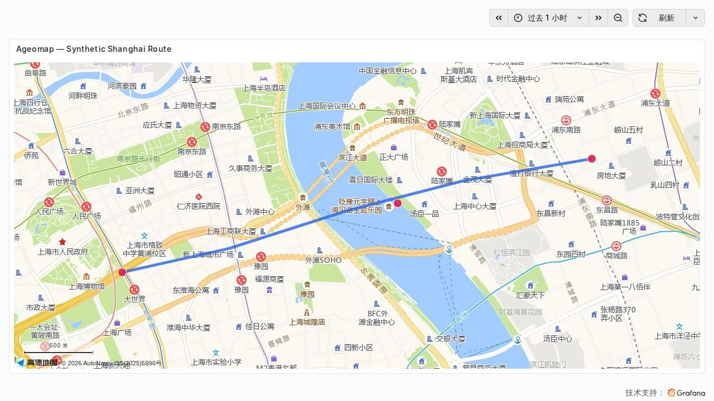

# Ageomap

**简体中文** | [English](README.en.md)

在 Grafana 面板中直接使用高德地图 Web JS API 2.0 矢量地图展示轨迹和标点。

> [!WARNING]
> Ageomap 0.1.0 会把高德 Key 和 `securityJsCode` 保存在 dashboard JSON 中。当前 Beta
> 版本仅适合启用了身份认证、用户可信的自托管 Grafana；请勿用于匿名访问或公开分享的
> dashboard。

## 功能

- 使用高德地图原生矢量渲染，无需 iframe、外部页面或自建瓦片服务。
- 按 Grafana 查询 `refId` 绘制轨迹或圆形标点。
- 可在浏览器中把 WGS-84 坐标转换为 GCJ-02。
- 支持经纬度字段匹配、逐查询样式和纯文本悬浮提示。
- 可跟随 Grafana 明暗主题，并提供工具条、比例尺和自动缩放。

Ageomap 专用于高德地图。如果需要其他底图、Geohash、热力图或更多通用图层类型，
Grafana Geomap 通常更合适。

## 开始使用

1. 阅读[安装与配置](docs/setup.md)，侧载未签名插件并配置高德凭据。
2. 阅读[使用指南](docs/usage.md)，准备查询数据并配置轨迹、标点和地图样式。
3. 阅读[设计与安全](docs/design.md)，了解技术取舍、数据流、安全边界和当前限制。

当前版本为 Beta `0.1.0`，要求 Grafana `12.3.0` 或更高版本。未签名插件只能侧载到
自托管 Grafana OSS 或 Grafana Enterprise，不能安装到 Grafana Cloud。

## 开发来源

本项目主要由 GitHub Copilot 设计和实现，由人类维护者负责产品方向、关键决策和审查。

## 许可证与商标

源代码采用 [Apache License 2.0](LICENSE)。使用高德地图服务须遵守适用的高德条款并
使用自己的凭据。Grafana Labs 标志、AMap 和高德地图均为其各自权利人的商标；
Ageomap 是独立第三方项目。完整声明见[设计与安全](docs/design.md#商标与项目关系声明)。
