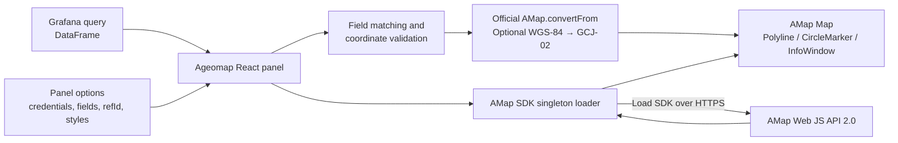

# Design and security

[简体中文](design.md) | **English** | [Project home](../README.en.md) | [Setup](setup.en.md) | [Usage guide](usage.en.md)

## Project scope

Grafana Geomap can display XYZ URLs, including AMap raster tile patterns. Ageomap instead uses the
official AMap Web JS API 2.0 and focuses on AMap vector maps, routes, and markers in Grafana.

| AMap XYZ tiles in Geomap                                    | Ageomap                                                         |
| ----------------------------------------------------------- | --------------------------------------------------------------- |
| Raster images at fixed zoom levels                          | Native AMap 2.0 vector rendering with smooth, continuous zoom   |
| 256 px labeled tiles can look soft on high-DPI screens      | Labels, roads, and POIs rendered by the AMap vector engine      |
| A single tile style does not follow Grafana light/dark mode | Separate light and dark styles can follow Grafana automatically |
| WGS-84 coordinates must be converted elsewhere              | Optional WGS-84 to GCJ-02 conversion is built into the panel    |
| Often relies on undocumented tile URL patterns              | Uses the official AMap Web JS API                               |
| OpenLayers renders overlays separately from the basemap     | Routes, markers, and tooltips use native AMap objects           |

This tradeoff also means Ageomap is not a general-purpose map panel. Grafana Geomap remains the
better choice for other basemaps, geohashes, query layers, heatmaps, and a broader set of layers.

## Architecture and data flow

All map processing occurs in the browser inside the Grafana page:

1. The React panel reads Grafana DataFrames and panel options.
2. Each DataFrame is resolved by `refId` as `route`, `marker`, or `none`.
3. The panel matches coordinate fields and discards invalid coordinates.
4. WGS-84 data is converted to GCJ-02 asynchronously in batches through the official
   `AMap.convertFrom` API.
5. The SDK loader fetches AMap Web JS API 2.0 over HTTPS.
6. The panel renders native AMap `Polyline`, `CircleMarker`, and `InfoWindow` objects.

The project has no backend component, iframe, external page, or self-managed tile server.

## SDK loading and lifecycle

Grafana uses an AMD module-loading environment. The AMap SDK's UMD wrapper can register itself as
an anonymous AMD module and leave `window.AMap` unavailable. The loader temporarily hides
`window.define.amd` only while the SDK script executes and restores it on success or failure.

The SDK is loaded once per page. Matching credentials reuse the load result; different credentials
produce an explicit error requiring a Grafana page reload. Load failures and the 15-second timeout
are displayed in the panel.

Official coordinate conversion runs sequentially in batches of up to 40 coordinate pairs. The plan
converts markers first, uniformly samples up to 40 points from each route for a coarse preview, then
fills routes from newest to oldest using the time field. Row order is the fallback when no valid
time field exists. Previous overlays remain until the preview is ready; the preview then replaces
them and route paths update after each subsequent batch. The panel displays converted and total
point counts.

Data or option changes supersede older conversions; after the current request completes, stale work
submits no further batches and cannot overwrite the newer map. Conversion failures and the
15-second timeout are displayed in the panel.

When the panel is destroyed, it removes overlays, closes tooltips, and destroys the map instance.
Panel size changes resize the map. Data, theme, and style changes redraw overlays, and auto-fit
reframes the available data.

## Security and privacy

### Credential boundary

- The AMap Key and `securityJsCode` are regular panel options stored in dashboard JSON.
- Grafana does not encrypt them; users who can view or export a dashboard may be able to read them.
- The Key is sent to AMap as an SDK URL query parameter, while `securityJsCode` is placed in the
  browser-side security configuration required by AMap.
- Server-side secret storage and AMap `serviceHost` proxy mode are not implemented.
- The project does not send query data to a service operated by this project, but the AMap SDK's
  own network behavior is governed by AMap services and applicable terms.

The current beta is therefore intended only for authenticated, trusted, self-hosted Grafana.
Use exact domain restrictions, least privilege, separate Keys, and quota alerts. Do not expose
dashboard JSON, snapshots, or repositories containing credentials.

### Data handling

- Coordinates and tooltip fields are read in the browser.
- Empty, non-numeric, and out-of-range coordinates are not passed to map overlays.
- Hover content uses DOM `textContent`; query values are never executed as HTML.
- WGS-84 data is handled by the official `AMap.convertFrom` API. Network processing by the SDK is
  governed by AMap services and their applicable terms.

## Current limitations

- The AMap Key and `securityJsCode` do not use server-side secure storage or proxy mode.
- Changing credentials after the SDK loads requires a Grafana page reload.
- Multiple AMap credential sets are not supported on the same Grafana page.
- World-map and multilingual-map permissions are not exposed as panel options.
- The plugin remains an unsigned beta and cannot be installed on Grafana Cloud.
- The panel renders route polylines and circle markers, not Geomap's other general-purpose layers.

## Development provenance

This project was primarily designed and implemented by GitHub Copilot, under the product
direction, decisions, and review of its human maintainer. This statement describes the development
process and does not change the maintainer's responsibility for releases, code review, or project
governance.

## Trademarks and project relationship

The Grafana Labs Marks are trademarks of Grafana Labs and are used with Grafana Labs' permission.
Ageomap is not affiliated with, endorsed, or sponsored by Grafana Labs or its affiliates.

AMap and 高德地图 are trademarks of their respective owners. Ageomap is an independent
third-party project and is not affiliated with, endorsed, or sponsored by AMap, 高德地图, or
their affiliates.

## License

The Ageomap source code is licensed under the [Apache License 2.0](../LICENSE). The license applies
only to Ageomap source code; use of AMap services remains subject to the applicable AMap terms and
requires your own credentials.
