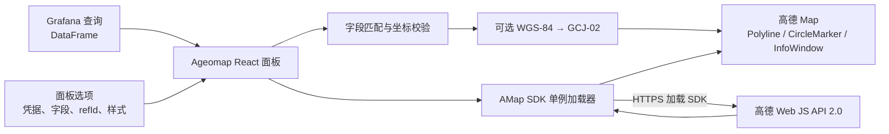

# 设计与安全

**简体中文** | [English](design.en.md) | [项目首页](../README.md) | [安装配置](setup.md) | [使用指南](usage.md)

## 项目定位

Grafana Geomap 可以显示包括高德栅格瓦片在内的 XYZ 地址。Ageomap 改用官方高德
Web JS API 2.0，专注于在 Grafana 中渲染高德矢量地图、轨迹和标点。

| Geomap 中的高德 XYZ 瓦片                | Ageomap                                   |
| --------------------------------------- | ----------------------------------------- |
| 固定缩放级别的栅格图片                  | 高德 2.0 原生矢量渲染，支持平滑、连续缩放 |
| 256 px 标注瓦片在高分辨率屏幕上可能模糊 | 由高德矢量引擎渲染标注、道路和 POI        |
| 单一瓦片样式无法跟随 Grafana 明暗主题   | 浅色和深色样式可自动跟随 Grafana          |
| WGS-84 坐标需要在其他环节转换           | 面板内置可选的 WGS-84 到 GCJ-02 转换      |
| 通常依赖未公开的瓦片地址格式            | 使用官方高德 Web JS API                   |
| OpenLayers 与底图分别绘制覆盖物         | 轨迹、标点和提示使用高德原生对象          |

这种取舍也意味着 Ageomap 不是通用地图面板。其他底图、Geohash、查询图层、热力图和
更多图层类型仍应优先考虑 Grafana Geomap。

## 架构与数据流

所有地图处理都在 Grafana 页面中的浏览器端完成：

1. React 面板读取 Grafana DataFrame 和面板选项。
2. 每个 DataFrame 按 `refId` 解析为 `route`、`marker` 或 `none`。
3. 面板匹配经纬度字段，丢弃无效坐标，并按需转换坐标系。
4. SDK 加载器通过高德 HTTPS 地址加载 Web JS API 2.0。
5. 面板使用高德原生 `Polyline`、`CircleMarker` 和 `InfoWindow` 对象绘制内容。

项目没有后端组件、iframe、外部页面或自建瓦片服务。

## SDK 加载与生命周期

Grafana 使用 AMD 模块加载环境，而高德 SDK 的 UMD 包装可能把自己注册为匿名 AMD
模块，导致 `window.AMap` 不可用。加载器仅在 SDK 脚本执行期间临时隐藏
`window.define.amd`，完成或失败后立即恢复。

SDK 在一个页面内单例加载。相同凭据会复用加载结果；不同凭据会返回明确错误，要求
用户重新加载 Grafana 页面。加载错误和 15 秒超时会显示在面板上。

面板销毁时会移除覆盖物、关闭提示、销毁地图实例；面板尺寸变化时通知高德地图调整
尺寸。数据、主题或样式变化时会重绘覆盖物，自动缩放开启时重新适应数据范围。

## 安全与隐私

### 凭据边界

- 高德 Key 和 `securityJsCode` 是普通面板选项，会进入 dashboard JSON。
- Grafana 不会加密这些值；能查看或导出 dashboard 的用户可能读取它们。
- Key 会作为高德 SDK 地址的查询参数发送给高德，`securityJsCode` 会写入高德要求的
  浏览器端安全配置。
- 当前没有服务端安全存储，也没有高德 `serviceHost` 代理模式。
- 本项目不会主动把查询数据发送到自有服务，但高德 SDK 自身的网络行为受高德服务和
  适用条款约束。

因此，当前 Beta 版本只适合已认证、用户可信的自托管 Grafana。应使用精确域名限制、
最小权限、独立 Key 和配额告警；不要公开 dashboard JSON、snapshot 或包含凭据的
仓库内容。

### 数据处理

- 经纬度和提示字段在浏览器中读取。
- 超出有效范围、空值和非数字坐标不会传入地图覆盖物。
- 悬浮提示使用 DOM `textContent`，不会把查询值作为 HTML 执行。
- WGS-84 到 GCJ-02 转换在浏览器中完成；中国范围外坐标保持不变。

## 当前限制

- 高德 Key 和 `securityJsCode` 尚未使用服务端安全存储或代理模式。
- SDK 加载后更换凭据必须重新加载 Grafana 页面。
- 同一 Grafana 页面不支持多组不同的高德凭据。
- 世界地图和多语言地图权限尚未暴露为面板选项。
- 插件仍是未签名 Beta，无法安装到 Grafana Cloud。
- 当前只绘制轨迹折线和圆形标点，不提供 Geomap 的其他通用图层。

## 开发来源

本项目主要由 GitHub Copilot 设计和实现，由人类维护者负责产品方向、关键决策和审查。
这项说明描述开发过程，不改变维护者对发布、代码审查和项目治理的责任。

## 商标与项目关系声明

Grafana Labs 标志是 Grafana Labs 的商标，本项目依照 Grafana Labs 的许可使用这些
标志。Ageomap 与 Grafana Labs 或其关联方不存在隶属关系，亦未获得其认可、背书或
赞助。

AMap 和高德地图是其各自权利人的商标。Ageomap 是独立第三方项目，与 AMap、高德地图
或其关联方不存在隶属关系，亦未获得其认可、背书或赞助。

## 许可证

Ageomap 源代码采用 [Apache License 2.0](../LICENSE)。第三方代码声明见
[THIRD_PARTY_NOTICES.md](../THIRD_PARTY_NOTICES.md)。该许可证只适用于 Ageomap
源代码；使用高德地图服务仍须遵守适用的高德条款并使用自己的凭据。
